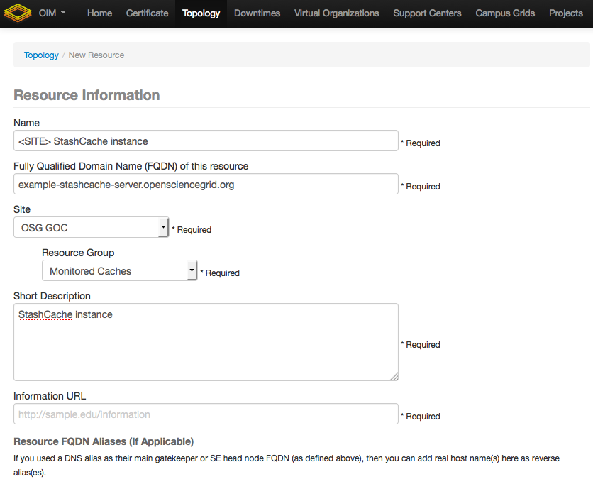
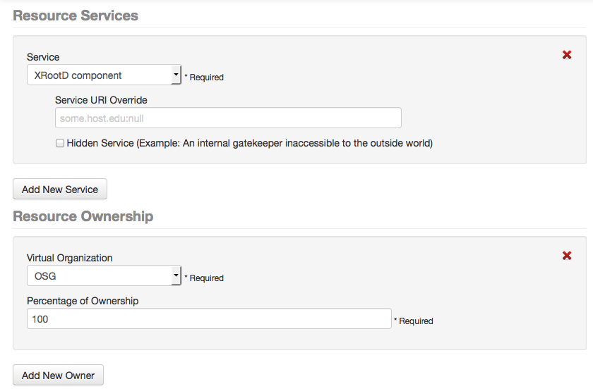
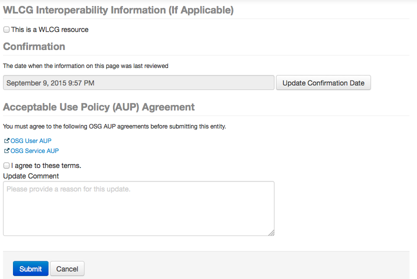

# Registering StashCache and RSV monitoring

To join in on the monitoring you'll need to Register your resource and send me some information about your cache instructions in the Configuring resource monitoring.

You can see the current state of affairs here:
* [Status history](http://myosg.grid.iu.edu/rgstatushistory/index?downtime_attrs_showpast=&account_type=cumulative_hours&ce_account_type=gip_vo&se_account_type=vo_transfer_volume&bdiitree_type=total_jobs&bdii_object=service&bdii_server=is-osg&start_type=yesterday&start_date=08%2F28%2F2015&end_type=now&end_date=08%2F28%2F2015&rg=on&rg_sel%5B%5D=433&active=on&active_value=1&disable_value=1)
* [Status details](http://myosg.grid.iu.edu/rgcurrentstatus/index?datasource=currentstatus&rg=on&rg_433=on&end_type=now&active=on&active_value=1) (click on the "+" sign for more detail)
* [Availability metrics](http://myosg.grid.iu.edu/rgarmetric/index?downtime_attrs_showpast=&account_type=cumulative_hours&ce_account_type=gip_vo&se_account_type=vo_transfer_volume&bdiitree_type=total_jobs&bdii_object=service&bdii_server=is-osg&start_type=7daysago&start_date=08%2F28%2F2015&end_type=now&end_date=08%2F28%2F2015&rg=on&rg_sel%5B%5D=433&active=on&active_value=1&disable_value=1) 

## Registering StashCache
To register a cache instance go [here](https://oim.grid.iu.edu/oim/resourceedit) (with a cert in your browser). Fill in the required fields, example is displayed below:

### Registering StashCache resource information: 
* the site __must be__ _OSG-GOC_ 
* the resource group __must be__ _Monitored Caches_

### Registering StashCache resource services: 
* the service __must be__ XRootD component

!!! Note: Contact Information (will be pre-filled, add or modify as you see fit) - there are several types of contact, administrative and security are the most important to the GOC - __DO NOT__ check the WLCG resource box; Add a Update comment if you'd like.

### Confirming and submitting StashCache resource registration: 
* you must click the __"Acceptable Use Policy"__ checkbox

## Configuring resource monitoring for RSV
E.g. for the Indiana instance the status of the following command is checked: `xrdcp root://redirector.osgstorage.org//stash/user/test.1M /tmp/dump`
If the return status is zero, the cache is working, otherwise it is not. What we need from you is:
* the equivalent `//stash/user/test.1M` a file you select that will always be there.
